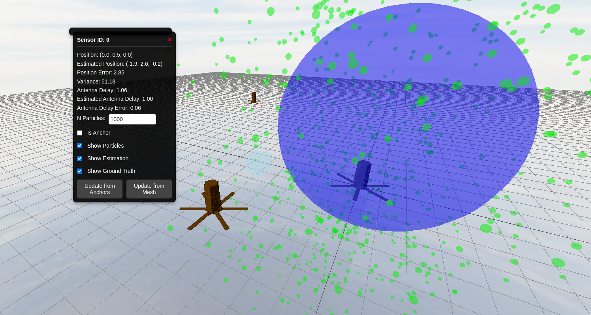

# 3D particule filter web demo

This is a demo of a particle filter algorithm running in a web browser. It showcases a strategy for estimating the position of nodes in 3D space using only ranging data from either anchors or other nodes. This implementation extends the 2D version by incorporating three-dimensional calculations and visualizations. At least one anchor update is required for a valid solution.

## Features

- **3D Visualization**: Uses three.js for rendering a 3D scene, with particles represented as green spheres and the estimated position displayed as a blue sphere.

- **Interactive UI**: Each sensor has a dedicated menu accessible by clicking on it. Menus are draggable, and you can close them with the Escape key.

- **Efficient Backend**: The particle filter algorithm is implemented in C++ for portability. The logic runs in the browser via WebAssembly (WASM), compiled using Emscripten.

- **Parameter Adjustments**: Modify parameters like particle count and noise variance through the UI.

- **! Work in Progress !**: Upcoming features include improved UI with shortcuts, modeling antenna delay, and better antenna delay modeling.

## How to Use
To run the demo, access the following [link](https://colvertyety.github.io/PArticuleFilter3DWeb/).

## Interactions:

Use 'WASD' or 'ZQSD' to move the transparent cursor in the scene.

Press 'Enter' to add a new node at the cursor's position.

Press 'BackSpace' a selected node.

**Anchors**: Fixed points with low ranging variance, displayed in orange.

**Nodes**: Estimated positions are displayed as blue spheres with their uncertainty visualized by particle spread (green spheres).

Access node-specific menus by clicking on nodes.
Drag menus around the screen as needed.
Press Escape to close open menus.

## Noise Modeling
This project models channel noise as a combination of different components to simulate real-world ranging errors:

**Gaussian Noise**: Random noise due to measurement uncertainty.

**Distance-Proportional Noise**:
- Transmitter Antenna Delay: Proportional to the true ranging distance.
- Receiver Antenna Delay: Also proportional to the true ranging distance.

Each measurement is modeled as:

    Measured Distance = True Distance + Gaussian Noise + (Transmitter Antenna Delay * Distance) + (Receiver Antenna Delay * Distance)

Future work will incorporate antenna delay modeling directly into the particle filter algorithm to enhance accuracy.