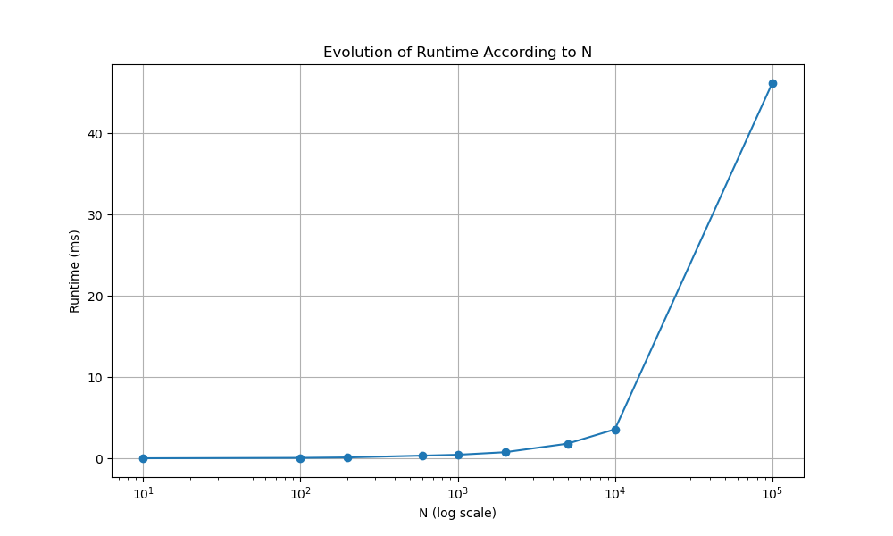

# analysis of the Filter behaviour

## Geometric convergence

The following showcases the evolution of the distance between estimates and real positions. In this test one round of updates are done to the anchors and then updates are only performed according to the mesh.

## Convergence according to N 

The following showcases the evolution of the distance between estimates and real positions according to the number of particles. 

## runtime

Here is the runtime according to the number of particules.

